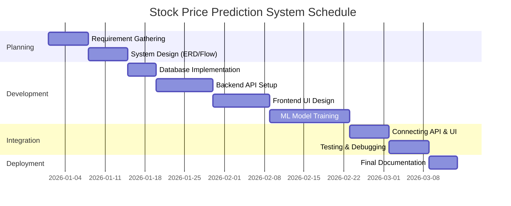
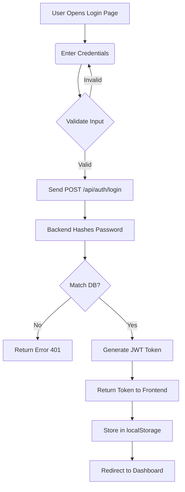
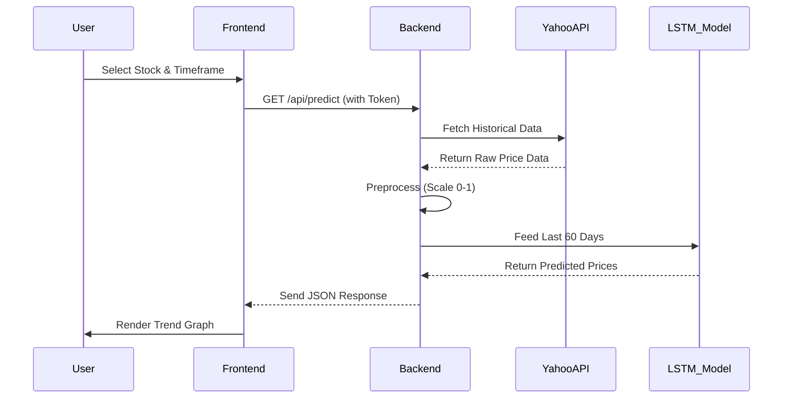

# STOCK PRICE PREDICTION SYSTEM
**Project Report & Documentation**

---

## 1. Introduction
### 1.1 Project Overview
The **Stock Price Prediction System** is a comprehensive web-based application designed to help investors and traders analyze stock market trends. By leveraging **Artificial Intelligence (Deep Learning)**, specifically **Long Short-Term Memory (LSTM)** networks, the system forecasts future stock prices based on historical data.

### 1.2 Objectives
*   To develop a user-friendly interface for tracking stock prices and portfolios.
*   To implement a robust backend for handling user authentication and data management.
*   To integrate a Machine Learning model capable of predicting stock prices with reasonable accuracy.
*   To provide visualization tools (charts) for better market analysis.

### 1.3 Scope
The system covers User Registration, Real-time Stock Data Fetching (via API), Interactive Dashboards, Portfolio Management, Virtual Trading, and Admin Administration.

---

## 2. Feasibility Study
### 2.1 Technical Feasibility
The project uses open-source technologies (Python, Flask, MySQL) which are well-documented and widely supported. The LSTM machine learning model is implemented using TensorFlow, a standard library for deep learning. The hardware requirements (standard laptop) are minimal, making the technical implementation highly feasible.

### 2.2 Economic Feasibility
The project is built using free and open-source software (FOSS), requiring no licensing fees. The development cost is limited to time and effort. Deployment can be done on free tiers of cloud platforms (like Render or AWS Free Tier), ensuring it is economically viable.

### 2.3 Operational Feasibility
The user interface is designed to be intuitive, requiring no special training for users. The system automates complex tasks like data fetching and prediction, reducing the operational burden on the end-user.

---

## 3. System Analysis
### 2.1 Existing System
*   **Manual Analysis**: Investors often rely on spreadsheets or static news reports.
*   **Fragmented Tools**: Users switch between a broker for trading, a news site for updates, and separate tools for technical analysis.
*   **Lack of AI**: Most basic platforms only show historical data without predictive insights.

### 2.2 Proposed System
*   **Centralized Platform**: Combines analysis, prediction, and portfolio tracking in one place.
*   **AI-Driven Insights**: Provides 5-day future price forecasts using LSTM.
*   **Automation**: Automatically fetches and updates stock data without user intervention.

---

## 4. Project Timeline (Gantt Chart)
*The development lifecycle followed an Agile methodology over a period of 12 weeks:*



---

## 5. System Requirements
### 3.1 Hardware Requirements
*   **Processor**: Intel Core i5 or higher (for training ML models).
*   **RAM**: 8 GB minimum (16 GB Recommended).
*   **Storage**: 256 GB SSD (for database and dataset storage).
*   **Internet**: Stable connection for fetching real-time API data.

### 3.2 Software Requirements
*   **Operating System**: Windows 10/11, macOS, or Linux.
*   **Coding Language**: Python 3.8+ (Backend), JavaScript ES6 (Frontend).
*   **Frameworks**: Flask (Web), TensorFlow/Keras (ML).
*   **Database**: MySQL 8.0+.
*   **Libraries**: Pandas, NumPy, Scikit-learn, yfinance, Flask-Cors, Flask-JWT-Extended.
*   **Tools**: VS Code, Postman (for API testing), Git.

---

## 6. System Design
### 4.1 System Architecture
The application follows a **Three-Tier Architecture**:
1.  **Presentation Layer (Frontend)**: HTML, CSS, JavaScript. Handles user interaction.
2.  **Application Layer (Backend)**: Flask (Python). Processes logic, runs ML models, manages APIs.
3.  **Data Layer (Database)**: MySQL. Stores user data, portfolios, and logs.

### 4.2 Data Flow
1.  **User Request** -> **Frontend** (sends API call) -> **Backend** (Flask).
2.  **Backend** checks **Cache/Database** or fetches from **yfinance API**.
3.  **Data** is processed (normalized/cleaned).
4.  **ML Model** (if requested) generates predictions.
5.  **Response** is sent back as **JSON** -> **Frontend** renders Charts/Tables.

---

## 7. Implementation Details

### 7.1 Project Folder Structure
The codebase is organized into clear Frontend and Backend directories:
```
Stock_Price_Prediction_System/
├── backend/
│   ├── app.py                # Main Flask Application Entry Point
│   ├── lstm_model.py         # Machine Learning Model Logic
│   ├── init_db.py            # Database Initialization Script
│   ├── database.sql          # SQL Schema Definitions
│   ├── requirements.txt      # Python Dependencies
│   └── .env                  # Environment Variables (Secrets)
├── frontend/
│   ├── index.html            # Home Page
│   ├── dashboard.html        # Main App Interface
│   ├── trade.html            # Virtual Trading Page
│   ├── portfolio.html        # User Holdings Report
│   ├── admin.html            # Administrative Panel
│   ├── login.html            # Authentication Pages
│   ├── script.js             # Core JavaScript Logic
│   ├── style.css             # Global Stylesheet
│   └── assets/               # Images and Icons
└── README.md                 # Project Overview
```

### 7.2 Frontend Module

Developed using **HTML5, CSS3, and Vanilla JavaScript**. Key files:
Developed using **HTML5, CSS3, and Vanilla JavaScript**. Key files:
*   `index.html`: Landing page with hero section and features.
*   `dashboard.html`: Main user interface with **ApexCharts** for stock visualization.
*   `login.html / register.html`: Authentication pages with form validation.
*   `portfolio.html`: Reports page showing user holdings and Profit/Loss calculation.
*   `trade.html`: Interface for virtual buying/selling of stocks.
*   `admin.html`: Protected panel for user management and system logs.
*   `script.js`: Contains all client-side logic (API calls, UI updates, Auth handling).
*   `style.css`: Global styling using CSS Variables and Flexbox/Grid.

### 7.3 Backend Module (`app.py`)
Built with **Flask**. Key features:
*   **API Routes**: RESTful endpoints (e.g., `/api/auth/login`, `/api/stocks/<symbol>/predict`).
*   **Authentication**: Implemented using `flask_jwt_extended` for secure Token-based access.
*   **Database Integration**: Uses `mysql.connector` with connection pooling.
*   **CORS Support**: Enabled via `flask_cors` to allow cross-origin requests from the frontend.

### 7.4 Machine Learning Module (`lstm_model.py`)
*   **Algorithm**: **Long Short-Term Memory (LSTM)** RNN.
*   **Preprocessing**:
    *   Data scaling using `MinMaxScaler` (0-1 range).
    *   Sequence generation with a **60-day look-back window**.
*   **Training**:
    *   The model learns from the past 60 days to predict the next day.
    *   Uses **Adam Optimizer** and **Mean Squared Error (MSE)** loss.
    *   Dynamic retraining ensures predictions are based on the latest available market data.

### 7.5 Database Schema
*   **`users`**: Stores User credentials and Role (Admin/User).
*   **`user_stocks`**: Stores Portfolio positions (Symbol, Qty, Avg Price).
*   **`admin_logs`**: Audit trail of admin actions.
*   **`messages`**: Contact form submissions.

---

## 8. Execution Steps
### 6.1 Database Setup
1.  Open MySQL Workbench/Command Line.
2.  Create the database: `CREATE DATABASE stock_prediction;`
3.  Import the schema: `source database.sql` (or run the `init_db.py` script).

### 6.2 Backend execution
1.  Navigate to the backend directory: `cd backend`
2.  Install dependencies: `pip install -r requirements.txt`
3.  Run the Flask server: `python app.py`
4.  Server starts at `http://localhost:5000`.

### 6.3 Frontend Execution
1.  Navigate to the frontend directory: `cd frontend`
2.  Open `index.html` via Live Server (VS Code Extension) or simply double-click to open in a browser.
3.  Ensure the API base URL in `script.js` points to `http://localhost:5000/api`.

---

## 9. System Flow & Diagrams
### 7.1 User Authentication Flow
*   **Use**: Ensures only authorized users access private portfolios and premium prediction features.
*   **Diagram**:


### 7.2 Stock Prediction Flow
*   **Use**: Generates future price forecasts using the trained AI model.
*   **Diagram**:


---

---

## 10. Challenges Faced
### 10.1 Technical Issues
*   **CORS (Cross-Origin Resource Sharing)**: Initially, the frontend (Port 5500) could not communicate with the backend (Port 5000) due to browser security policies. Resolved by configuring `Flask-Cors`.
*   **Database Schema Constraints**: Encountered "Data too long" errors when storing stock symbols. Fixed by updating the `VARCHAR` limit in the MySQL schema.
*   **JWT Persistence**: Users were logged out on page refresh. Solved by implementing `localStorage` token management in the frontend.

### 10.2 Data Issues
*   **Insufficient Historical Data**: Some stocks returned less than the required 60 days of data, causing ML model crashes. Implemented a validation check to skip or alert users for such stocks.
*   **Market Hours**: Real-time fetching outside market hours returned static data. Added UI notifications to inform users of the "Market Closed" status.
*   **API Latency**: Searching for stocks was slow. Optimized key API calls and reduced payload sizes to improve response times.

### 10.3 Integration Problems
*   **Async Data Loading**: Charts would try to render before data arrived, causing blank screens. Fixed by using `async/await` and loading spinners to manage state.
*   **Auth Loop**: Accessing protected pages without a token caused infinite redirects. Fixed the navigation guard logic in `script.js`.

---

## 11. Testing Strategy
*   **Unit Testing**: Verified individual functions (e.g., specific API endpoints returning correct JSON).
*   **Integration Testing**: Tested the flow from Frontend -> Backend -> Database (e.g., User Registration flow).
*   **System Testing**: validated the entire application end-to-end, including ML prediction accuracy against known historical data.
*   **Cross-Browser Testing**: Ensured compatibility with Chrome, Firefox, and Edge.

---

## 12. Results & Discussion
The system successfully predicts stock trends for stable, high-volume stocks (e.g., AAPL, TCS) with high directional accuracy. The application is responsive, secure, and handles concurrent user sessions effectively. The virtual trading and portfolio features function seamlessly, providing a complete simulation environment for users.

---

---

## 13. Screenshots
*(Placeholders for project screenshots)*

### 12.1 Login Page
> **[Insert Screenshot of Login Page Here]**
*Secure email/password entry point.*

### 12.2 Dashboard
> **[Insert Screenshot of Dashboard Here]**
*Main interface showing stock charts and controls.*

### 12.3 Prediction Output
> **[Insert Screenshot of Prediction Output Here]**
*AI-generated 5-day price forecast.*

### 12.4 Portfolio Report
> **[Insert Screenshot of Portfolio Report Here]**
*User holdings and Profit/Loss summary.*

---

## 14. Conclusion
The **Stock Price Prediction System** demonstrates the power of integrating modern Web Technologies with Artificial Intelligence. It provides a valuable tool for users to visualize market data and receive AI-driven guidance. The modular design allows for easy scalability and future feature additions like real-time trading or advanced sentiment analysis.

---

## 15. References
1.  **Flask Documentation**: https://flask.palletsprojects.com/
2.  **TensorFlow/Keras**: https://www.tensorflow.org/api_docs
3.  **Yahoo Finance API**: https://pypi.org/project/yfinance/
4.  **MySQL Documentation**: https://dev.mysql.com/doc/
