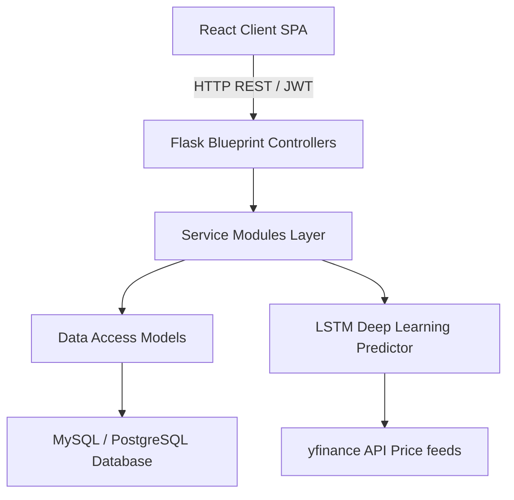

# Project Architecture - Stock Prediction Platform

This document describes the modular architectural design system of both the React frontend and Flask backend modules.

---

## 1. System Topology Overview

The system is built on a modern **Three-Tier decoupled architecture**:

---

## 2. Decoupled Core Components

### Presentation Layer (React + Vite client)
*   **Context System**: Centralizes global state for authentications (`AuthContext`) and theme preferences (`ThemeContext`).
*   **Custom Hooks**: Exposes unified wrappers for data operations (`useStocks`, `usePortfolio`, `useAuth`).
*   **Service Wrappers**: Centralizes axios configurations and custom endpoint calls.

### Application Logic Layer (Flask backend)
*   **Blueprint Controllers**: Coordinates route mapping and parameter checks.
*   **Services Layer**: Houses heavy transaction arithmetic, currency conversions, and model validation checks.
*   **Models Layer**: Exposes static SQL execution queries keeping classes clean.
